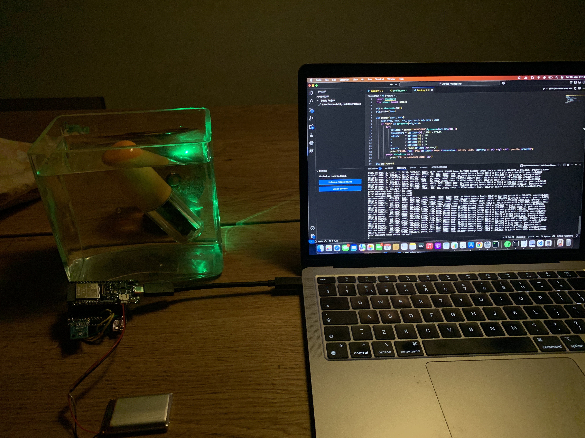
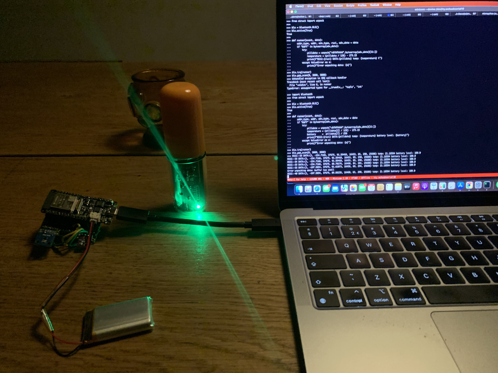
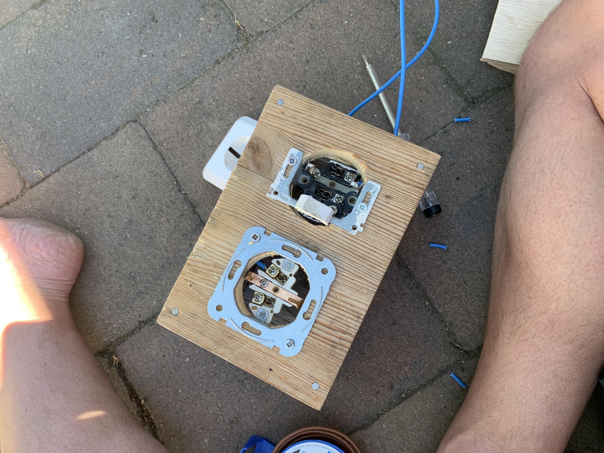
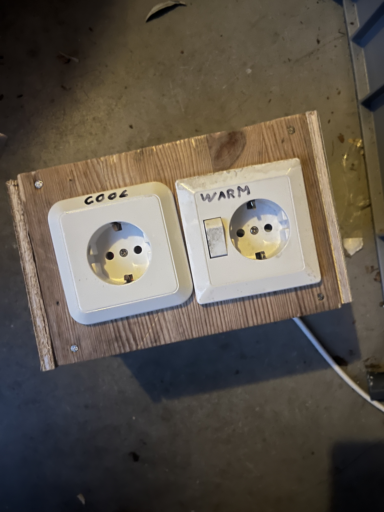
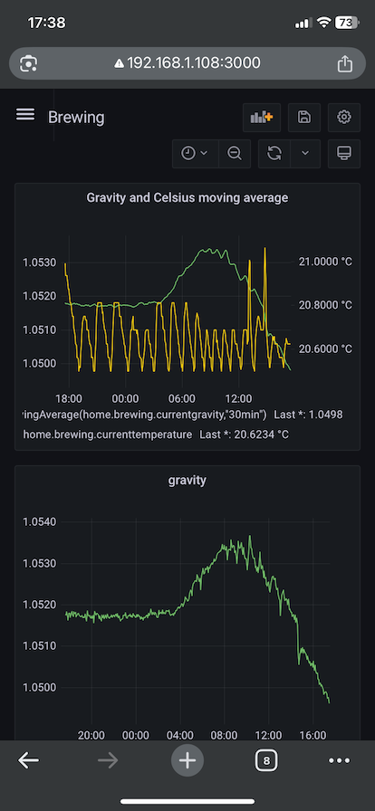

# MicroBrew: simple ESP32/MicroPython powered brew logic

As a hobby I like to brew beer every now and then, to mash/cook i rely on my BrewMonk 
and to keep temperature i used to have an InkBird to on/off my cooling chambre(fridge).

I thought it would be fun to make my own one and integrate hydrometer/gravity metrics with it
since i recently bought a "rapt pill" to measure real time specific gravity. The Rapt Pill normally
only operates with the companies cloud infra/dashboard, so I was also curious if i could figure out
how to capture and store this data myself using micropython and an esp32 specifically.

I scraped together some left over parts/power-outlets/relays and soldered 🪛 together the necessary 
components on a prototyping board. I ended up creating a simple API driven controller, and thought
it would be useful for others to use as well. This is by no means a fully fledged solution, but it
might be a good starting point to start tinkering yourself or save you the rapt pill reverse engineering
headaches 😅.

Third Party libraries like [microdot](https://github.com/miguelgrinberg/microdot) not written by me but were very useful! ❤️
## Capabilities

- Control heating
- Control cooling
- Read current gravity realtime from Rapt using BLE
- Specify target temperature
- Simple hysteresis control
- Configuration through API
- Read Metrics through API (grafana/prometheus)
- Bluetooth metrics exposing (gravity,temperature,battery-level and rssi)
- Debug mode capability / run without actual sensor input

-- TODO -- 
- Integrate Oled status screen (OT822-C66)
- Create more minimal/nicer enclosure/casing

## Configuration

### WIFI

Change `wireless.json` inside the `settings` directory, and specify your AP SSID and PASSWORD like this;

```json
{
    "SSID": "SSID_GOES_HERE",
    "PASSWORD": "PASSWORD_GOES_HERE"
}
```

### HARDWARE\SENSOR specific

Change `profile.json` inside the `settings` directory, and specify the needed values ;

```json
{
    "temperatureMode": "target",   
    "temperatureUnit": "celsius",
    "temperatureSensor": "raptpill",
    "thermalState": "OFF",
    "targetTemperature": 20,
    "coolingPin": 3,
    "heatingPin": 2,
    "hysteresis": 0.5
}
```

This is pretty statically tied into my hardware setup but I will explain the configuration KEYs :

```yaml
temperatureMode : can be either `manual` or `target`
temperatureUnit : can be either `celsius` or `fahrenheit`
temperatureSensor : is now pinned to the `raptpill` sensor but in theory any temp sensor can be used *WIP*
thermalState : can be either `ON` or `OFF`, default heating state adhered when using `manual` Mode
targetTemperature: fermentation temperature float(), uses `temperatureUnit`
coolingPin : specific PIN.OUT on controller-relay to power on chambre/fridge
heatingPin : specific PIN.OUT on controller-relay to power on heating inside chambre/fridge
hysteresis : Allowed deviation during cooling/warming, to avoid continual state changes.
```

## API

Currently I exposed `3` api routes, one where you can do a `POST` call to set/change specific key-values under `/control` and two
mainly to retrieve metrics under `/metrics` and `/prometheus` that last one specifically if you want to use a Prometheus to Scrape the metrics.

### examples

POST `/control`
```bash
curl -H "Content-Type: application/json" -X POST -d '{ "targetTemperature":22,"hysteresis":0.5}' http://CONTROLLER_IP/control
```

GET `/metrics`
```bash
curl http://CONTROLLER_IP/metrics | jq
```
example output:
```bash
➜  ~ curl --silent http://192.168.10.123/metrics | jq
{
  "heatingPin": 2,
  "currentGravity": 1.23873,
  "yAxis": -239.625,
  "ReceivedSignalStrength": -59,
  "coolingPin": 3,
  "zAxis": 1024.5,
  "targetTemperature": 20,
  "temperatureUnit": "celsius",
  "batteryPercentage": 77.69922,
  "currentTemperature": 18.06094,
  "thermalState": "HEATING",
  "xAxis": 67.75,
  "temperatureSensor": "raptpill",
  "hysteresis": 0.5,
  "temperatureMode": "target"
}
```

## HARDWARE/IMPRESSION PICS 📸

<p align="center">
  
  
  
  
  
  
</p>
<p align="center">
    
</p>
